# AI Garage — Supabase ERD

Reference for the AI Garage Postgres schema (Supabase): **94 tables** in the `public` schema, grouped into 13 domains. The Mermaid diagrams are the same definitions rendered in the internal technical doc (§05); the column tables are generated from the live schema, with hand-written notes where a column needs explaining.

> **Tenancy.** The tenant is the **organization** (subdomain = `organizations.slug`), which owns one or more **locations** (branches). Every table falls into one of three scoping classes:
>
> - **Customer-global** — `organization_id`, read via `private.is_org_staff()`: customers, vehicles, plans, reminders. A customer registers once per org.
> - **Operational** — `location_id`, read via `private.is_location_member()`: bookings, jobs, bays, services, products, inspections, …
> - **Financial** — `location_id` for branch separation **and** `organization_id` so org finance (owner / admin / accountant, `private.is_org_finance()`) reads across branches: invoices, credit notes, payments, quotes.
>
> The trigger `private.set_org_from_location` backfills `organization_id` from `location_id` on insert. RLS helpers live in the non-API `private` schema; new tables ship with policies scoped `to authenticated` using them. Each table below lists its policies by command.

**Reading the column tables:** `→` is a foreign key (with its `on delete` action), backticked pipe lists are CHECK-constrained values, _null_ marks a nullable column.

---

## Domain map

```mermaid
graph LR
  organizations(["organizations"]) --> locations(["locations"])
  subgraph IDENTITY["1 Identity and tenancy"]
    org_users
    location_users
    location_special_hours
    role_templates
    webauthn_credentials
    staff_notification_prefs
    platform_admins
    org_slug_history
    location_slug_history
  end
  subgraph CRM["2 Customers and vehicles"]
    customers
    vehicles
    fleet_companies
    tyre_checks
    mot_tests
    vehicle_history_entries
  end
  subgraph SCHED["3 Scheduling and work"]
    bookings
    bays
    services
    jobs
    job_items
    job_time_entries
    work_authorisations
    courtesy_cars
    courtesy_car_loans
    location_ev_readiness
  end
  subgraph QUOTES["4 Quotes and inspections"]
    quotes
    quote_items
    quote_revisions
    inspections
    inspection_items
    inspection_media
    inspection_templates
    inspection_template_items
  end
  subgraph MONEY["5 Invoicing and payments"]
    invoices
    invoice_jobs
    credit_notes
    payments
    payment_allocations
    finance_applications
    finance_provider_configs
  end
  subgraph COMMS["6 Communications"]
    reminders
    scheduled_tasks
    review_requests
    held_comms
    email_suppressions
    unsubscribe_tokens
  end
  subgraph RECOVER["7 Recovery and tyre care"]
    deferred_work
    tyre_recommendations
    tyre_care_runs
    vehicle_wheel_profile
    wheel_service_events
  end
  subgraph STOCK["8 Inventory and purchasing"]
    products
    suppliers
    supplier_integrations
    purchase_orders
    purchase_order_items
  end
  subgraph PLANS["9 Memberships and plans"]
    service_plans
    service_plan_items
    plan_subscriptions
    plan_invites
    plan_service_usage
  end
  subgraph BOOKS["10 Accounting and imports"]
    accounting_connections
    accounting_sync_log
    accounting_payouts
    import_batches
    imported_invoices
  end
  subgraph GROWTH["11 Growth surfaces"]
    org_sites
    receptionist_configs
    receptionist_conversations
  end
  subgraph SYS["12 Platform and system"]
    audit_log
    doc_shares
    stripe_webhook_events
    webhook_deliveries
    staff_notifications
    data_deletion_log
    password_reset_tokens
    feature_flags
    ai_usage_events
    support_tickets
    support_ticket_messages
  end
  subgraph OPS["13 Reliability and analytics"]
    cron_runs
    mot_delta_runs
    alert_rules
    incidents
    incident_updates
    uptime_checks
    uptime_rollup
    latency_samples
    sentry_issues
    sentry_snapshot
    page_views
    page_view_daily
  end
  organizations --> IDENTITY
  organizations --> CRM
  locations --> SCHED
  locations --> QUOTES
  locations --> MONEY
  locations --> COMMS
  locations --> RECOVER
  locations --> STOCK
  organizations --> PLANS
  organizations --> BOOKS
  organizations --> GROWTH
  organizations --> SYS
  OPS
```

---

## Tenant root

The two tables every scoping class hangs off.

### `organizations`

The tenant. Brand identity, tenant-billing state (`tenant_*`), Stripe Connect status, compliance flags, org-wide settings (quote validity, variation threshold, parts markup, labour cost rate, AI brief).

Scope: tenant root · RLS — select: `is_org_member` / `is_platform_admin` · update: `is_org_owner`

Unique: `(stripe_account_id) WHERE (stripe_account_id IS NOT NULL)` · `(tenant_stripe_subscription_id) WHERE (tenant_stripe_subscription_id IS NOT NULL)`

| Column | Type | Notes |
|---|---|---|
| `id` | `uuid` | PK |
| `slug` | `text` | Unique. · The tenant subdomain (`<slug>.<root>`). |
| `name` | `text` | Display name. |
| `primary_color` | `text` | Hex (e.g. `#22c55e`). Drives all branded surfaces. |
| `logo_url` | `text` | Storage URL. · _null_ |
| `custom_domain` | `text` | Unique. · **Parked** (#454, `docs/custom-domains.md`): the resolver never routes on it. · _null_ |
| `created_at` | `timestamptz` |  |
| `phone` | `text` | Used in reminder copy. · _null_ |
| `portal_theme` | `text` | `dark` \| `light` \| `glass` \| `workshop` · UI theme key for customer portal. |
| `google_review_url` | `text` | Surfaced on review prompts. · _null_ |
| `privacy_policy_url` | `text` | Per-tenant override of `/privacy`. · _null_ |
| `data_retention_years` | `int2` | Drives auto-prune of historical comms. |
| `dpa_accepted_at` | `timestamptz` | _null_ |
| `dpa_accepted_by_user_id` | `uuid` | _null_ |
| `dpa_version` | `text` | _null_ |
| `stripe_account_id` | `text` | Connect Express account id. · _null_ |
| `stripe_charges_enabled` | `bool` |  |
| `stripe_payouts_enabled` | `bool` |  |
| `stripe_details_submitted` | `bool` |  |
| `quote_deposit_pct` | `numeric(5,2)` |  |
| `quote_validity_days` | `int4` |  |
| `tenant_plan` | `text` | `starter` \| `pro` \| `growth` |
| `tenant_subscription_status` | `text` | _null_ |
| `tenant_stripe_customer_id` | `text` | _null_ |
| `tenant_stripe_subscription_id` | `text` | _null_ |
| `tenant_current_period_end` | `timestamptz` | _null_ |
| `tenant_trial_end` | `timestamptz` | _null_ |
| `no_show_fee_pence` | `int4` |  |
| `primary_location_id` | `uuid` | → `locations.id` (set null) · _null_ |
| `ai_profile` | `jsonb` | _null_ |
| `ai_brief` | `text` | Org AI brief injected into every AI feature. · _null_ |
| `ai_onboarded_at` | `timestamptz` | _null_ |
| `quote_reminder_days` | `int4[]` | _null_ |
| `quote_reminder_max` | `int4` | _null_ |
| `quote_reminders_enabled` | `bool` | _null_ |
| `vat_registered` | `bool` |  |
| `vat_number` | `text` | _null_ |
| `deferred_followup_days` | `int4[]` |  |
| `authorisation_terms` | `text` | _null_ |
| `variation_threshold_pct` | `numeric` | Work-auth variation warning threshold (warn, never block). |
| `labour_cost_rate` | `numeric(10,2)` | _null_ |
| `credit_control_mode` | `text` | `warn` \| `block` |
| `setup_checklist_dismissed_at` | `timestamptz` | _null_ |
| `activation_stage` | `int4` |  |
| `parts_markup_rules` | `jsonb` | _null_ |
| `parts_target_margin_pct` | `int4` | _null_ |
| `business_structure` | `text` | `sole_trader` \| `partnership` \| `limited_company` · _null_ |
| `tyre_rotation_miles` | `int4` |  |
| `tyre_balance_miles` | `int4` |  |

### `locations`

A branch. Operational boundary; hours, address, invoice prefix, prelive state (`live_at`) and first-run controls.

Scope: `organization_id` · RLS — insert: `is_org_owner` · select: `is_org_member` / `is_location_member` · update: `is_org_owner`

| Column | Type | Notes |
|---|---|---|
| `id` | `uuid` | PK |
| `slug` | `text` | Unique. · Branch slug, unique in the org: the `/b/<slug>` path. The subdomain is the org slug. |
| `name` | `text` |  |
| `created_at` | `timestamptz` |  |
| `organization_id` | `uuid` | → `organizations.id` (cascade) |
| `business_hours_start` | `int2` |  |
| `business_hours_end` | `int2` |  |
| `address` | `text` | _null_ |
| `business_hours` | `jsonb` | Per-weekday hours `{ "0..6": { open, close } }` in minutes from midnight; missing weekday = closed. See `src/lib/business-hours.ts`. |
| `invoice_prefix` | `text` | Branch prefix on document numbers. · _null_ |
| `live_at` | `timestamptz` | Null = **prelive**: crons hold unattended comms (`held_comms`). · _null_ |
| `first_run_cap` | `int4` | Max messages per run in the first 24 h after `live_at`. Null = uncapped. · _null_ |
| `chase_prelive_debt` | `bool` | Whether dunning may chase invoices already overdue at go-live (permanent). |
| `mot_subcontracted` | `bool` |  |

---

## Domain 1 · Identity & tenancy

The tenant is the **organization** (its slug is the subdomain); it owns one or more **locations** (branches). Staff belong to the org (`org_users`: owner / admin / accountant) and/or to branches (`location_users` + a permissions JSON snapshotted from `role_templates`).

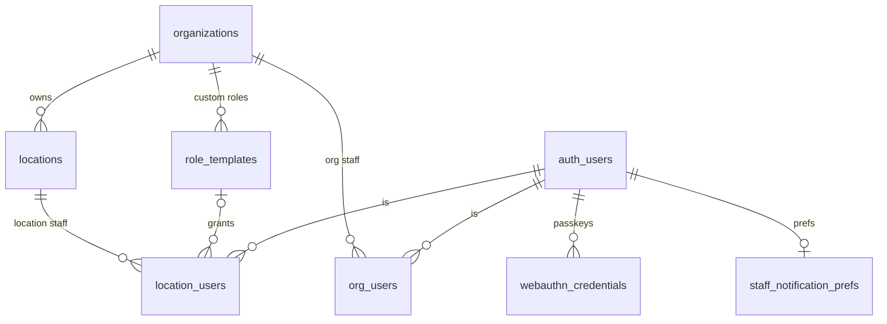

### `org_users`

Org-level membership: `owner` / `admin` (every branch) or `accountant` (finance only).

Scope: `organization_id` · RLS — delete: `is_org_owner` · insert: `is_org_owner` · select: `is_org_member` · update: `is_org_owner`

Unique: `(user_id, organization_id)`

| Column | Type | Notes |
|---|---|---|
| `id` | `uuid` | PK |
| `user_id` | `uuid` | → `auth.users.id` (cascade) |
| `organization_id` | `uuid` | → `organizations.id` (cascade) |
| `role` | `text` | `owner` \| `admin` \| `accountant` |
| `created_at` | `timestamptz` |  |

### `location_users`

Branch membership with a role and a permissions JSON (snapshotted from a role template; edits don't propagate).

Scope: `location_id` · RLS — delete: `is_org_owner` · insert: `is_org_owner` · select: `is_org_owner` / `is_location_member` · update: `is_org_owner`

Unique: `(user_id, location_id)`

| Column | Type | Notes |
|---|---|---|
| `id` | `uuid` | PK |
| `user_id` | `uuid` | → `auth.users.id` (cascade) |
| `location_id` | `uuid` | → `locations.id` (cascade) |
| `role` | `text` | `manager` \| `service_advisor` \| `mechanic` \| `apprentice` \| `receptionist` \| `parts` \| `bookkeeper` \| `staff` · `staff` is a legacy alias. |
| `created_at` | `timestamptz` |  |
| `permissions` | `jsonb` | Per-feature flags. |
| `mot_tester` | `bool` |  |
| `mot_qc_reviewer` | `bool` |  |
| `template_id` | `uuid` | → `role_templates.id` (set null) · _null_ |
| `ev_level` | `int2` | _null_ |
| `ev_certified_at` | `date` | _null_ |
| `ev_expires_at` | `date` | _null_ |

### `location_special_hours`

One-off date overrides (bank holidays, special opening). A row for a date wins over the weekly `business_hours`.

Scope: `location_id` + `organization_id` · RLS — delete: `is_org_admin` · insert: `is_org_admin` · select: `is_location_member` · update: `is_org_admin`

Unique: `(location_id, date)`

| Column | Type | Notes |
|---|---|---|
| `id` | `uuid` | PK |
| `organization_id` | `uuid` | → `organizations.id` (cascade) · backfilled from `location_id` |
| `location_id` | `uuid` | → `locations.id` (cascade) |
| `date` | `date` | Unique per `(location_id, date)`. |
| `is_closed` | `bool` | Closed all day. |
| `open_minute` | `int2` | _null_ |
| `close_minute` | `int2` | _null_ |
| `note` | `text` | e.g. "Christmas Day". · _null_ |
| `created_at` | `timestamptz` |  |

### `role_templates`

Permission presets: system rows (`organization_id` null, `is_system`) plus org-owned custom templates.

Scope: `organization_id` · RLS — delete: inline org-role check · insert: inline org-role check · select: inline org-role check · update: inline org-role check

Unique: `(organization_id, key)`

| Column | Type | Notes |
|---|---|---|
| `id` | `uuid` | PK |
| `organization_id` | `uuid` | → `organizations.id` (cascade) · _null_ |
| `key` | `text` |  |
| `label` | `text` |  |
| `description` | `text` | _null_ |
| `permissions` | `jsonb` |  |
| `is_system` | `bool` |  |
| `sort_order` | `int4` |  |
| `created_by` | `uuid` | → `auth.users.id` (set null) · _null_ |
| `created_at` | `timestamptz` |  |
| `updated_at` | `timestamptz` |  |

### `webauthn_credentials`

Registered passkeys (staff and customers).

Scope: platform / global · RLS — select: own rows (`auth.uid()`)

| Column | Type | Notes |
|---|---|---|
| `id` | `uuid` | PK |
| `user_id` | `uuid` |  |
| `credential_id` | `text` | Unique. |
| `public_key` | `text` | Base64 (text column, not bytea). |
| `counter` | `int8` | Anti-clone counter. |
| `transports` | `text[]` | _null_ |
| `device_name` | `text` | User-supplied label. · _null_ |
| `created_at` | `timestamptz` |  |
| `last_used_at` | `timestamptz` | _null_ |

### `staff_notification_prefs`

Per-user email toggles. No row = opted in.

Scope: platform / global · RLS — insert: own rows (`auth.uid()`) · select: own rows (`auth.uid()`) · update: own rows (`auth.uid()`)

| Column | Type | Notes |
|---|---|---|
| `user_id` | `uuid` | PK · → `auth.users.id` (cascade) |
| `weekly_digest` | `bool` |  |
| `updated_at` | `timestamptz` |  |

### `platform_admins`

Operator accounts for the `admin.` portal (alongside the `PLATFORM_ADMIN_EMAILS` allowlist).

Scope: platform / global · RLS — select: `is_platform_admin`

| Column | Type | Notes |
|---|---|---|
| `user_id` | `uuid` | PK · → `auth.users.id` (cascade) |
| `invited_by` | `uuid` | → `auth.users.id` (set null) · _null_ |
| `created_at` | `timestamptz` |  |

### `org_slug_history`

Previous org slugs, so old subdomain links redirect after a rename.

Scope: `organization_id` · RLS — select: `is_platform_admin`

| Column | Type | Notes |
|---|---|---|
| `id` | `uuid` | PK |
| `old_slug` | `text` | Unique. |
| `organization_id` | `uuid` | → `organizations.id` (cascade) |
| `created_at` | `timestamptz` |  |

### `location_slug_history`

Previous branch slugs, for redirecting `/b/<slug>` links.

Scope: `location_id` + `organization_id` · RLS — select: `is_platform_admin`

| Column | Type | Notes |
|---|---|---|
| `id` | `uuid` | PK |
| `old_slug` | `text` | Unique. |
| `location_id` | `uuid` | → `locations.id` (cascade) |
| `organization_id` | `uuid` | → `organizations.id` (set null) · _null_ |
| `created_at` | `timestamptz` |  |

---

## Domain 2 · Customers & vehicles

**Customer-global**: a customer registers once per org and is visible to staff at every branch (`is_org_staff`). `customers.preferred_location_id` is the home branch that customer-level automation sends from; `vehicles.location_id` is the servicing branch the MOT-delta cron routes on.

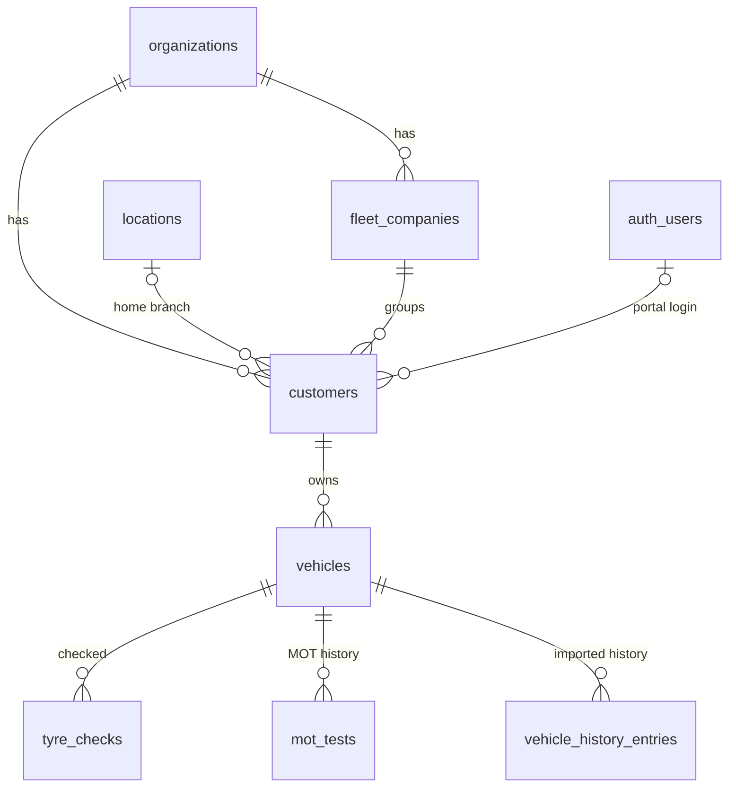

### `customers`

End customer, unique per `(organization_id, lower(email))`. Optionally linked to `auth.users` for the portal. Trade-account terms live here.

Scope: `organization_id` · RLS — delete: `is_org_staff` · insert: `is_org_staff` · select: `is_org_staff` · update: `is_org_staff`

Unique: `(organization_id, lower(email)) WHERE ((email IS NOT NULL) AND (email <> ''::text))`

| Column | Type | Notes |
|---|---|---|
| `id` | `uuid` | PK |
| `user_id` | `uuid` | → `auth.users.id` (set null) · Set once the customer signs in to the portal. · _null_ |
| `email` | `text` | _null_ |
| `phone` | `text` | _null_ |
| `full_name` | `text` | _null_ |
| `created_at` | `timestamptz` |  |
| `fleet_company_id` | `uuid` | → `fleet_companies.id` (set null) · Fleet grouping. · _null_ |
| `marketing_email_consent` | `bool` | Required for marketing sends (campaigns, win-back, tyre care). |
| `marketing_sms_consent` | `bool` | Required for marketing SMS. |
| `consent_updated_at` | `timestamptz` | _null_ |
| `anonymized_at` | `timestamptz` | Set on GDPR erasure; excluded from every automated sender. · _null_ |
| `accounting_contact_id` | `text` | _null_ |
| `organization_id` | `uuid` | → `organizations.id` (cascade) |
| `preferred_location_id` | `uuid` | → `locations.id` (set null) · Home branch: customer-level automation sends from here. · _null_ |
| `account_customer` | `bool` | Trade account (consolidated billing, statements, credit control). |
| `payment_terms_days` | `int4` |  |
| `credit_limit` | `numeric(10,2)` | _null_ |
| `consolidated_billing` | `bool` |  |
| `is_demo` | `bool` |  |

### `vehicles`

A customer's car. MOT / service / tax dates drive the reminder pipeline.

Scope: `location_id` + `organization_id` · RLS — delete: `is_org_staff` · insert: `is_org_staff` · select: `is_org_staff` · update: `is_org_staff`

Unique: `(location_id, registration)` · `(organization_id, registration)`

| Column | Type | Notes |
|---|---|---|
| `id` | `uuid` | PK |
| `location_id` | `uuid` | → `locations.id` (cascade) · Servicing branch (MOT-delta routing). |
| `customer_id` | `uuid` | → `customers.id` (cascade) |
| `registration` | `text` | UK plate. |
| `make` | `text` | _null_ |
| `model` | `text` | _null_ |
| `year` | `int4` | _null_ |
| `mot_expiry` | `date` | _null_ |
| `service_due` | `date` | _null_ |
| `created_at` | `timestamptz` |  |
| `recall_status` | `text` | _null_ |
| `recall_checked_at` | `timestamptz` | _null_ |
| `recall_detail` | `text` | _null_ |
| `tax_due_date` | `date` | _null_ |
| `last_mot_test_date` | `date` | _null_ |
| `mot_synced_at` | `timestamptz` | _null_ |
| `moted_elsewhere_at` | `timestamptz` | _null_ |
| `fuel_type` | `text` | _null_ |
| `organization_id` | `uuid` | → `organizations.id` (cascade) |
| `is_demo` | `bool` |  |

### `fleet_companies`

Business customers that group several end customers.

Scope: `location_id` · RLS — select: `is_location_member`

| Column | Type | Notes |
|---|---|---|
| `id` | `uuid` | PK |
| `location_id` | `uuid` | → `locations.id` (cascade) |
| `name` | `text` |  |
| `contact_name` | `text` | _null_ |
| `contact_email` | `text` | _null_ |
| `contact_phone` | `text` | _null_ |
| `notes` | `text` | _null_ |
| `created_at` | `timestamptz` | _null_ |

### `tyre_checks`

Per-vehicle tread depths and replacements. Feeds tyre care (tread gaps, fitment baseline) and mileage evidence.

Scope: `location_id` + `organization_id` · RLS — select: `is_location_member`; `is_org_staff`

| Column | Type | Notes |
|---|---|---|
| `id` | `uuid` | PK |
| `vehicle_id` | `uuid` | → `vehicles.id` (cascade) |
| `location_id` | `uuid` | → `locations.id` (cascade) |
| `checked_at` | `date` |  |
| `nsf_depth` | `numeric(4,1)` | _null_ |
| `osf_depth` | `numeric(4,1)` | _null_ |
| `nsr_depth` | `numeric(4,1)` | _null_ |
| `osr_depth` | `numeric(4,1)` | _null_ |
| `nsf_replaced` | `bool` | _null_ |
| `osf_replaced` | `bool` | _null_ |
| `nsr_replaced` | `bool` | _null_ |
| `osr_replaced` | `bool` | _null_ |
| `notes` | `text` | _null_ |
| `created_at` | `timestamptz` | _null_ |
| `organization_id` | `uuid` | → `organizations.id` (cascade) · _null_ |
| `job_id` | `uuid` | → `jobs.id` (set null) · _null_ |
| `odometer_miles` | `int4` | _null_ |

### `mot_tests`

DVSA MOT history per vehicle (result, odometer, defects). Mileage evidence for tyre care.

Scope: `organization_id` · RLS — select: `is_org_staff`

Unique: `(vehicle_id, test_date)`

| Column | Type | Notes |
|---|---|---|
| `id` | `uuid` | PK |
| `vehicle_id` | `uuid` | → `vehicles.id` (cascade) |
| `organization_id` | `uuid` | → `organizations.id` (cascade) |
| `test_date` | `date` |  |
| `result` | `text` | _null_ |
| `odometer_miles` | `int4` | _null_ |
| `defects` | `jsonb` |  |
| `source` | `text` | `lookup` \| `delta` |
| `created_at` | `timestamptz` |  |
| `updated_at` | `timestamptz` |  |

### `vehicle_history_entries`

Imported service history (migration toolkit). Deliberately not jobs, so it never pollutes the board, margins or reports.

Scope: `organization_id` · RLS — select: `is_org_staff`

| Column | Type | Notes |
|---|---|---|
| `id` | `uuid` | PK |
| `organization_id` | `uuid` | → `organizations.id` (cascade) |
| `vehicle_id` | `uuid` | → `vehicles.id` (cascade) |
| `happened_on` | `date` |  |
| `mileage` | `int4` | _null_ |
| `description` | `text` |  |
| `total` | `numeric(10,2)` | _null_ |
| `source` | `text` | `import` \| `manual` |
| `import_batch_id` | `uuid` | → `import_batches.id` (set null) · _null_ |
| `created_at` | `timestamptz` |  |

---

## Domain 3 · Scheduling & work

**Operational**, per branch (`is_location_member`). A booking becomes a job when work starts; a completed job is invoiced. Work authorisations are immutable artefacts (select + insert policies only).

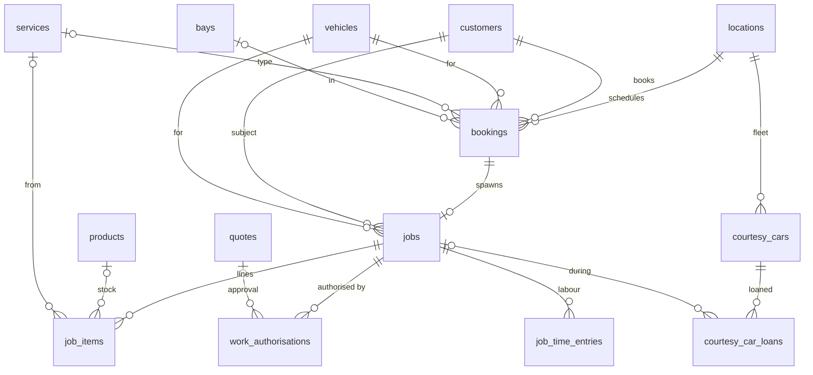

### `bookings`

Customer booking, optionally prepaid through the widget.

Scope: `location_id` · RLS — select: `is_location_member`

| Column | Type | Notes |
|---|---|---|
| `id` | `uuid` | PK |
| `location_id` | `uuid` | → `locations.id` (cascade) |
| `customer_id` | `uuid` | → `customers.id` (set null) · _null_ |
| `vehicle_id` | `uuid` | → `vehicles.id` (set null) · _null_ |
| `scheduled_at` | `timestamptz` |  |
| `duration_minutes` | `int4` | Default 60. |
| `type` | `text` | Service category snapshot. |
| `notes` | `text` | _null_ |
| `status` | `text` | `scheduled` \| `in_progress` \| `complete` \| `cancelled` \| `no_show` \| `payment_pending` |
| `created_at` | `timestamptz` | _null_ |
| `bay_id` | `uuid` | → `bays.id` (set null) · _null_ |
| `service_id` | `uuid` | → `services.id` (set null) · _null_ |
| `stripe_checkout_session_id` | `text` | _null_ |
| `stripe_payment_intent_id` | `text` | _null_ |
| `paid_at` | `timestamptz` | _null_ |
| `paid_amount_pence` | `int4` | _null_ |
| `from_quote_id` | `uuid` | → `quotes.id` (set null) · _null_ |
| `assigned_to` | `uuid` | → `auth.users.id` (set null) · _null_ |
| `confirm_token_hash` | `text` | _null_ |
| `confirmation_sent_at` | `timestamptz` | _null_ |
| `confirmed_at` | `timestamptz` | _null_ |
| `reschedule_requested_at` | `timestamptz` | _null_ |
| `stripe_customer_id` | `text` | _null_ |
| `stripe_setup_intent_id` | `text` | _null_ |
| `card_payment_method_id` | `text` | _null_ |
| `card_on_file_at` | `timestamptz` | _null_ |
| `no_show_charge_intent_id` | `text` | _null_ |
| `no_show_charged_at` | `timestamptz` | _null_ |
| `no_show_charge_amount_pence` | `int4` | _null_ |
| `no_show_charge_error` | `text` | _null_ |
| `covered_by_plan` | `bool` |  |
| `plan_subscription_id` | `uuid` | → `plan_subscriptions.id` (set null) · _null_ |
| `is_demo` | `bool` |  |

### `bays`

Physical service bays; double-booking is blocked server-side.

Scope: `location_id` · RLS — select: `is_location_member`

| Column | Type | Notes |
|---|---|---|
| `id` | `uuid` | PK |
| `location_id` | `uuid` | → `locations.id` (cascade) |
| `name` | `text` | e.g. "Bay 1". |
| `description` | `text` | _null_ |
| `sort_order` | `int4` |  |
| `created_at` | `timestamptz` | _null_ |

### `services`

Branch service catalogue; drives the booking widget and membership allowances.

Scope: `location_id` · RLS — select: `is_location_member`

| Column | Type | Notes |
|---|---|---|
| `id` | `uuid` | PK |
| `location_id` | `uuid` | → `locations.id` (cascade) |
| `name` | `text` |  |
| `description` | `text` | _null_ |
| `category` | `text` |  |
| `price` | `numeric(10,2)` | Set → booking widget collects payment upfront. · _null_ |
| `duration_minutes` | `int4` | _null_ |
| `vat_included` | `bool` | Affects invoice maths. |
| `active` | `bool` |  |
| `created_at` | `timestamptz` | _null_ |
| `vat_treatment` | `text` | `standard` \| `zero` \| `exempt` \| `outside_scope` |

### `jobs`

Work in progress, usually spawned from a booking.

Scope: `location_id` · RLS — select: `is_location_member`

| Column | Type | Notes |
|---|---|---|
| `id` | `uuid` | PK |
| `location_id` | `uuid` | → `locations.id` (cascade) |
| `customer_id` | `uuid` | → `customers.id` (set null) · _null_ |
| `vehicle_id` | `uuid` | → `vehicles.id` (set null) · _null_ |
| `booking_id` | `uuid` | → `bookings.id` (set null) · _null_ |
| `status` | `text` | `open` \| `complete` \| `invoiced` (app-enforced, no CHECK). |
| `description` | `text` | _null_ |
| `notes` | `text` | _null_ |
| `created_at` | `timestamptz` | _null_ |
| `completed_at` | `timestamptz` | _null_ |
| `assigned_to` | `uuid` | → `auth.users.id` (set null) · _null_ |
| `high_voltage` | `bool` |  |
| `is_demo` | `bool` |  |
| `odometer_miles` | `int4` | _null_ |

### `job_items`

Job lines (labour / parts). `unit_cost` snapshots the part cost at fitting for margin maths.

Scope: platform / global · RLS — select: `is_location_member`

| Column | Type | Notes |
|---|---|---|
| `id` | `uuid` | PK |
| `job_id` | `uuid` | → `jobs.id` (cascade) |
| `description` | `text` |  |
| `quantity` | `numeric(10,2)` |  |
| `unit_price` | `numeric(10,2)` |  |
| `type` | `text` | `labour` \| `part` \| `other` (app-enforced). |
| `created_at` | `timestamptz` | _null_ |
| `product_id` | `uuid` | → `products.id` (set null) · _null_ |
| `service_id` | `uuid` | → `services.id` (set null) · _null_ |
| `vat_rate` | `numeric` |  |
| `unit_cost` | `numeric(10,2)` | Part cost snapshot at fitting (margin maths). · _null_ |
| `vat_treatment` | `text` | `standard` \| `zero` \| `exempt` \| `outside_scope` · _null_ |

### `job_time_entries`

Per-technician labour clock (start / pause / resume / stop).

Scope: `location_id` · RLS — select: `is_location_member`

| Column | Type | Notes |
|---|---|---|
| `id` | `uuid` | PK |
| `job_id` | `uuid` | → `jobs.id` (cascade) |
| `location_id` | `uuid` | → `locations.id` (cascade) |
| `user_id` | `uuid` | → `auth.users.id` (cascade) |
| `started_at` | `timestamptz` |  |
| `ended_at` | `timestamptz` | _null_ |
| `duration_minutes` | `int4` | _null_ |
| `note` | `text` | _null_ |
| `created_at` | `timestamptz` |  |
| `status` | `text` | `running` \| `paused` \| `completed` |
| `active_minutes` | `int4` |  |
| `segment_started_at` | `timestamptz` | _null_ |

### `work_authorisations`

Immutable authorisation artefacts: items + terms snapshotted as shown, with signature / typed name, IP and user agent.

Scope: `location_id` + `organization_id` · RLS — insert: `is_location_member` · select: `is_location_member`

| Column | Type | Notes |
|---|---|---|
| `id` | `uuid` | PK |
| `location_id` | `uuid` | → `locations.id` (cascade) |
| `organization_id` | `uuid` | → `organizations.id` (cascade) · _null_ |
| `job_id` | `uuid` | → `jobs.id` (cascade) · _null_ |
| `quote_id` | `uuid` | → `quotes.id` (set null) · _null_ |
| `customer_id` | `uuid` | → `customers.id` (set null) · _null_ |
| `kind` | `text` | `initial` \| `variation` |
| `method` | `text` | `counter_signature` \| `quote_approval` \| `reauth_link` |
| `status` | `text` | `pending` \| `authorised` \| `declined` |
| `authorised_total` | `numeric(10,2)` |  |
| `items_snapshot` | `jsonb` |  |
| `terms_snapshot` | `text` | _null_ |
| `signature_path` | `text` | _null_ |
| `signed_name` | `text` | _null_ |
| `ip` | `text` | _null_ |
| `user_agent` | `text` | _null_ |
| `token_hash` | `text` | Unique. · _null_ |
| `slug` | `text` | Unique. · `wa-` prefix (re-authorisation links). · _null_ |
| `requested_at` | `timestamptz` | _null_ |
| `authorised_at` | `timestamptz` | _null_ |
| `created_by` | `uuid` | → `auth.users.id` (set null) · _null_ |
| `created_at` | `timestamptz` |  |
| `updated_at` | `timestamptz` |  |
| `declined_reason` | `text` | _null_ |

### `courtesy_cars`

Branch courtesy-car fleet.

Scope: `location_id` · RLS — select: `is_location_member`

Unique: `(location_id, registration)`

| Column | Type | Notes |
|---|---|---|
| `id` | `uuid` | PK |
| `location_id` | `uuid` | → `locations.id` (cascade) |
| `registration` | `text` |  |
| `make` | `text` | _null_ |
| `model` | `text` | _null_ |
| `notes` | `text` | _null_ |
| `active` | `bool` |  |
| `created_at` | `timestamptz` |  |

### `courtesy_car_loans`

One loan per hand-over: fuel, odometer, photos and damage map out/in, signed agreement version.

Scope: `location_id` · RLS — select: `is_location_member`

Unique: `(car_id) WHERE (returned_at IS NULL)`

| Column | Type | Notes |
|---|---|---|
| `id` | `uuid` | PK |
| `location_id` | `uuid` | → `locations.id` (cascade) |
| `car_id` | `uuid` | → `courtesy_cars.id` (cascade) |
| `customer_id` | `uuid` | → `customers.id` (cascade) |
| `job_id` | `uuid` | → `jobs.id` (set null) · _null_ |
| `loaned_at` | `timestamptz` |  |
| `due_back_at` | `timestamptz` | _null_ |
| `returned_at` | `timestamptz` | _null_ |
| `fuel_out` | `int2` | _null_ |
| `fuel_in` | `int2` | _null_ |
| `odometer_out` | `int4` | _null_ |
| `odometer_in` | `int4` | _null_ |
| `condition_out` | `text` | _null_ |
| `condition_in` | `text` | _null_ |
| `licence_number` | `text` | _null_ |
| `licence_share_code` | `text` | _null_ |
| `agreement_name` | `text` | _null_ |
| `agreement_version` | `text` | _null_ |
| `agreement_signed_at` | `timestamptz` | _null_ |
| `created_by` | `uuid` | → `auth.users.id` (set null) · _null_ |
| `created_at` | `timestamptz` |  |
| `photos_out` | `text[]` |  |
| `photos_in` | `text[]` |  |
| `signature_url` | `text` | _null_ |
| `damage_out` | `jsonb` |  |
| `damage_in` | `jsonb` |  |

### `location_ev_readiness`

Branch EV-servicing readiness (SERMI status and reference).

Scope: `location_id` · RLS — select: `is_location_member`

| Column | Type | Notes |
|---|---|---|
| `id` | `uuid` | PK |
| `location_id` | `uuid` | → `locations.id` (cascade) · Unique. |
| `sermi_status` | `text` | `not_applied` \| `applied` \| `accredited` \| `lapsed` |
| `sermi_reference` | `text` | _null_ |
| `sermi_expires_at` | `date` | _null_ |
| `notes` | `text` | _null_ |
| `updated_at` | `timestamptz` |  |

---

## Domain 4 · Quotes & inspections

One unified `quotes` table (`quote_type` = `job` | `standalone`) replaced `job_quotes` + `standalone_quotes` (#253/#252). eVHC inspections capture RAG findings; their red/amber items become quote lines (`quote_items.inspection_item_id`). Inspection templates are org-scoped.

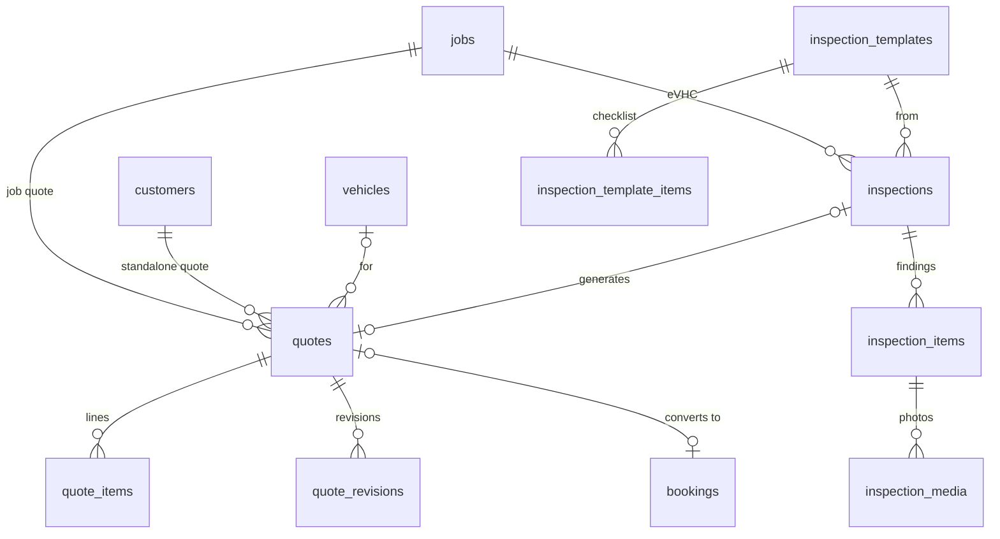

### `quotes`

Unified quotes (`job` mid-job DVI or `standalone` pre-job): token-gated customer link, per-item approval, deposit, revisions, reminders.

Scope: `location_id` + `organization_id` · RLS — all: `is_location_member`

| Column | Type | Notes |
|---|---|---|
| `id` | `uuid` | PK |
| `quote_type` | `quote_type` | enum: `job` \| `standalone` |
| `organization_id` | `uuid` | → `organizations.id` (cascade) |
| `location_id` | `uuid` | → `locations.id` (cascade) |
| `created_by` | `uuid` | → `auth.users.id` (set null) · _null_ |
| `job_id` | `uuid` | → `jobs.id` (cascade) · _null_ |
| `customer_id` | `uuid` | → `customers.id` (cascade) · _null_ |
| `vehicle_id` | `uuid` | → `vehicles.id` (set null) · _null_ |
| `title` | `text` |  |
| `description` | `text` | _null_ |
| `customer_message` | `text` | _null_ |
| `video_path` | `text` | _null_ |
| `video_mime` | `text` | _null_ |
| `video_size_bytes` | `int8` | _null_ |
| `video_duration_seconds` | `int4` | _null_ |
| `subtotal` | `numeric(10,2)` |  |
| `vat_rate` | `numeric(5,2)` |  |
| `vat_amount` | `numeric(10,2)` |  |
| `total` | `numeric(10,2)` |  |
| `status` | `text` | `draft` \| `pending` \| `approved` \| `declined` \| `rebooked` \| `expired` \| `cancelled` \| `approved_after_close` |
| `token_hash` | `text` | Unique. · sha256 of the customer link token. · _null_ |
| `slug` | `text` | Unique. · `q-` (job) / `sq-` (standalone) + 10 hex. · _null_ |
| `expires_at` | `timestamptz` | _null_ |
| `sent_at` | `timestamptz` | _null_ |
| `viewed_at` | `timestamptz` | _null_ |
| `viewed_count` | `int4` |  |
| `responded_at` | `timestamptz` | _null_ |
| `approved_item_ids` | `uuid[]` | _null_ |
| `applied_job_item_ids` | `uuid[]` | _null_ |
| `decline_reason` | `text` | _null_ |
| `deposit_pct` | `numeric(5,2)` | _null_ |
| `deposit_amount` | `numeric(10,2)` | _null_ |
| `deposit_required` | `bool` |  |
| `deposit_paid_at` | `timestamptz` | _null_ |
| `stripe_checkout_session_id` | `text` | _null_ |
| `stripe_payment_intent_id` | `text` | _null_ |
| `converted_booking_id` | `uuid` | → `bookings.id` (set null) · _null_ |
| `revision_number` | `int4` |  |
| `revision_note` | `text` | _null_ |
| `last_reminder_at` | `timestamptz` | _null_ |
| `reminder_count` | `int4` |  |
| `created_at` | `timestamptz` |  |
| `updated_at` | `timestamptz` |  |
| `sent_channels` | `text[]` |  |
| `link_token_encrypted` | `text` | _null_ |
| `is_demo` | `bool` |  |

### `quote_items`

Frozen quote line snapshot; may link back to an inspection finding.

Scope: platform / global · RLS — all: `is_location_member`

| Column | Type | Notes |
|---|---|---|
| `id` | `uuid` | PK |
| `quote_id` | `uuid` | → `quotes.id` (cascade) |
| `description` | `text` |  |
| `type` | `text` | `part` \| `labour` \| `other` |
| `quantity` | `numeric(10,2)` |  |
| `unit_price` | `numeric(10,2)` |  |
| `product_id` | `uuid` | → `products.id` (set null) · _null_ |
| `sort_order` | `int4` |  |
| `created_at` | `timestamptz` |  |
| `inspection_item_id` | `uuid` | → `inspection_items.id` (set null) · _null_ |

### `quote_revisions`

Prior versions of a quote's items when staff revise it.

Scope: platform / global · RLS — all: `is_location_member`

| Column | Type | Notes |
|---|---|---|
| `id` | `uuid` | PK |
| `quote_id` | `uuid` | → `quotes.id` (cascade) |
| `revision_number` | `int4` |  |
| `note` | `text` |  |
| `created_by` | `uuid` | → `auth.users.id` (set null) · _null_ |
| `created_at` | `timestamptz` |  |
| `items_snapshot` | `jsonb` | _null_ |

### `inspections`

An eVHC inspection on a job; token-gated customer report at `/check/<slug>`.

Scope: `location_id` + `organization_id` · RLS — all: `is_location_member`

| Column | Type | Notes |
|---|---|---|
| `id` | `uuid` | PK |
| `location_id` | `uuid` | → `locations.id` (cascade) |
| `organization_id` | `uuid` | → `organizations.id` (cascade) · _null_ |
| `job_id` | `uuid` | → `jobs.id` (cascade) |
| `vehicle_id` | `uuid` | → `vehicles.id` (set null) · _null_ |
| `template_id` | `uuid` | → `inspection_templates.id` (set null) · _null_ |
| `performed_by` | `uuid` | → `auth.users.id` (set null) · _null_ |
| `status` | `text` | `draft` \| `in_progress` \| `complete` \| `sent` |
| `quote_id` | `uuid` | → `quotes.id` (set null) · _null_ |
| `token_hash` | `text` | Unique. · _null_ |
| `slug` | `text` | Unique. · `hc-` prefix. · _null_ |
| `sent_at` | `timestamptz` | _null_ |
| `viewed_at` | `timestamptz` | _null_ |
| `viewed_count` | `int4` |  |
| `created_at` | `timestamptz` |  |
| `updated_at` | `timestamptz` |  |

### `inspection_items`

One checked point: RAG status, tech shorthand, customer wording, outcome.

Scope: platform / global · RLS — all: `is_location_member`

| Column | Type | Notes |
|---|---|---|
| `id` | `uuid` | PK |
| `inspection_id` | `uuid` | → `inspections.id` (cascade) |
| `template_item_id` | `uuid` | → `inspection_template_items.id` (set null) · _null_ |
| `section` | `text` |  |
| `label` | `text` |  |
| `rag` | `text` | `green` \| `amber` \| `red` \| `not_checked` |
| `note` | `text` | _null_ |
| `customer_summary` | `text` | _null_ |
| `outcome` | `text` | `none` \| `quoted` \| `approved` \| `declined` |
| `sort_order` | `int4` |  |
| `created_at` | `timestamptz` |  |
| `suggested_repair` | `text` | _null_ |
| `suggested_price` | `numeric(10,2)` | _null_ |
| `suggested_service_id` | `uuid` | → `services.id` (set null) · _null_ |
| `suggested_product_id` | `uuid` | → `products.id` (set null) · _null_ |

### `inspection_media`

Photos attached to inspection findings (private `inspection-media` bucket).

Scope: platform / global · RLS — all: `is_location_member`

| Column | Type | Notes |
|---|---|---|
| `id` | `uuid` | PK |
| `inspection_item_id` | `uuid` | → `inspection_items.id` (cascade) |
| `storage_path` | `text` |  |
| `mime` | `text` | _null_ |
| `size_bytes` | `int8` | _null_ |
| `created_at` | `timestamptz` |  |

### `inspection_templates`

Org-scoped checklist templates (a ~32-point UK template is seeded).

Scope: `organization_id` · RLS — select: `is_org_staff` · all: `is_org_admin`

Unique: `(organization_id, name)`

| Column | Type | Notes |
|---|---|---|
| `id` | `uuid` | PK |
| `organization_id` | `uuid` | → `organizations.id` (cascade) |
| `name` | `text` |  |
| `active` | `bool` |  |
| `created_at` | `timestamptz` |  |
| `updated_at` | `timestamptz` |  |

### `inspection_template_items`

Points on a template.

Scope: platform / global · RLS — select: `is_org_staff` · all: `is_org_admin`

| Column | Type | Notes |
|---|---|---|
| `id` | `uuid` | PK |
| `template_id` | `uuid` | → `inspection_templates.id` (cascade) |
| `section` | `text` |  |
| `label` | `text` |  |
| `sort_order` | `int4` |  |

---

## Domain 5 · Invoicing & payments

**Financial**: carries `location_id` for branch separation and `organization_id` so org finance (owner / admin / accountant) can read across branches. Consolidated trade invoices link jobs via `invoice_jobs`; the `payments` ledger allocates oldest-first.

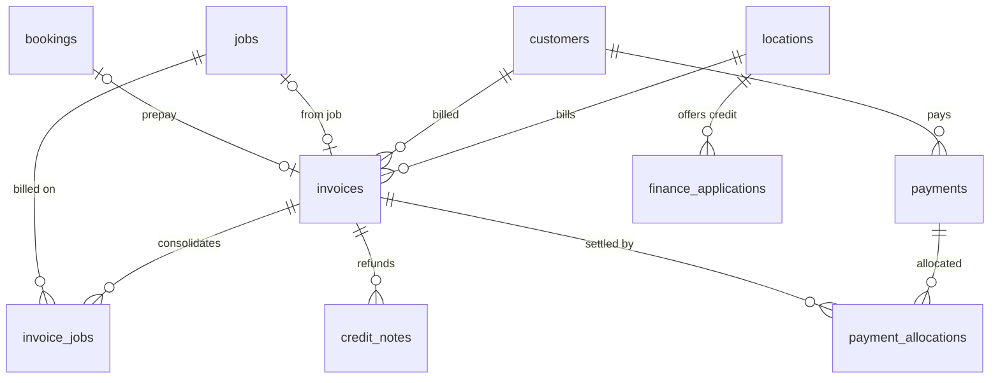

### `invoices`

Customer invoice — for a job, a prepaid booking, or a consolidated trade-account period (`job_id` null + `invoice_jobs`).

Scope: `location_id` + `organization_id` · RLS — select: `is_org_finance` / `is_location_member`

Unique: `(booking_id) WHERE (booking_id IS NOT NULL)` · `(location_id, invoice_number)`

| Column | Type | Notes |
|---|---|---|
| `id` | `uuid` | PK |
| `location_id` | `uuid` | → `locations.id` (cascade) |
| `customer_id` | `uuid` | → `customers.id` (set null) · _null_ |
| `job_id` | `uuid` | → `jobs.id` (set null) · job invoice · _null_ |
| `invoice_number` | `text` | Sequential, branch-prefixed (`locations.invoice_prefix`). |
| `status` | `text` | `draft` \| `sent` \| `paid`; overdue is computed (app-enforced). |
| `subtotal` | `numeric(10,2)` |  |
| `vat_rate` | `numeric(5,2)` |  |
| `vat_amount` | `numeric(10,2)` |  |
| `total` | `numeric(10,2)` |  |
| `issued_at` | `date` | _null_ |
| `due_at` | `date` | _null_ |
| `paid_at` | `timestamptz` | _null_ |
| `notes` | `text` | _null_ |
| `created_at` | `timestamptz` | _null_ |
| `stripe_checkout_session_id` | `text` | _null_ |
| `stripe_payment_intent_id` | `text` | _null_ |
| `stripe_paid_at` | `timestamptz` | _null_ |
| `stripe_paid_amount_pence` | `int4` | _null_ |
| `booking_id` | `uuid` | → `bookings.id` (set null) · prepay invoice · _null_ |
| `accounting_invoice_id` | `text` | _null_ |
| `accounting_synced_at` | `timestamptz` | _null_ |
| `accounting_payment_id` | `text` | _null_ |
| `last_dunned_at` | `timestamptz` | _null_ |
| `dunning_count` | `int4` |  |
| `discount_amount` | `numeric` |  |
| `discount_description` | `text` | _null_ |
| `membership_credit_amount` | `numeric` |  |
| `membership_credit_description` | `text` | _null_ |
| `organization_id` | `uuid` | → `organizations.id` (cascade) |
| `amount_paid` | `numeric(10,2)` | Ledger rollup; `paid` still means fully covered. |
| `is_demo` | `bool` |  |

### `invoice_jobs`

Jobs covered by a consolidated invoice. Unique `job_id` = a job is never billed twice.

Scope: platform / global · RLS — select: `is_org_finance` / `is_location_member`

| Column | Type | Notes |
|---|---|---|
| `id` | `uuid` | PK |
| `invoice_id` | `uuid` | → `invoices.id` (cascade) |
| `job_id` | `uuid` | → `jobs.id` (restrict) · Unique. |
| `amount` | `numeric(10,2)` |  |
| `created_at` | `timestamptz` |  |

### `credit_notes`

Refund credit notes; idempotent on `stripe_refund_id`, mirrored through the accounting seam.

Scope: `location_id` + `organization_id` · RLS — select: `is_org_finance` / `is_location_member`

Unique: `(location_id, credit_number)`

| Column | Type | Notes |
|---|---|---|
| `id` | `uuid` | PK |
| `location_id` | `uuid` | → `locations.id` (cascade) |
| `invoice_id` | `uuid` | → `invoices.id` (set null) · _null_ |
| `customer_id` | `uuid` | → `customers.id` (set null) · _null_ |
| `credit_number` | `text` | _null_ |
| `reason` | `text` | _null_ |
| `subtotal` | `numeric` |  |
| `vat_amount` | `numeric` |  |
| `total` | `numeric` |  |
| `status` | `text` | `issued` \| `synced` |
| `stripe_refund_id` | `text` | Unique. · _null_ |
| `accounting_credit_note_id` | `text` | _null_ |
| `created_by` | `uuid` | _null_ |
| `created_at` | `timestamptz` |  |
| `organization_id` | `uuid` | → `organizations.id` (cascade) |

### `payments`

Trade-account payments received (bank transfer, card via portal).

Scope: `location_id` + `organization_id` · RLS — select: `is_org_finance` / `is_location_member`

| Column | Type | Notes |
|---|---|---|
| `id` | `uuid` | PK |
| `location_id` | `uuid` | → `locations.id` (cascade) |
| `organization_id` | `uuid` | → `organizations.id` (cascade) · _null_ |
| `customer_id` | `uuid` | → `customers.id` (cascade) |
| `amount` | `numeric(10,2)` |  |
| `method` | `text` | `bank_transfer` \| `card` \| `cash` \| `cheque` \| `other` |
| `reference` | `text` | _null_ |
| `received_at` | `date` |  |
| `recorded_by` | `uuid` | → `auth.users.id` (set null) · _null_ |
| `created_at` | `timestamptz` |  |

### `payment_allocations`

Allocation of a payment to invoices, oldest first.

Scope: platform / global · RLS — select: `is_org_finance` / `is_location_member`

| Column | Type | Notes |
|---|---|---|
| `id` | `uuid` | PK |
| `payment_id` | `uuid` | → `payments.id` (cascade) |
| `invoice_id` | `uuid` | → `invoices.id` (restrict) |
| `amount` | `numeric(10,2)` |  |
| `created_at` | `timestamptz` |  |
| `accounting_payment_id` | `text` | _null_ |

### `finance_applications`

Consumer-finance applications raised through a provider (Bumper).

Scope: `location_id` + `organization_id` · RLS — select: `is_org_finance`; `is_location_member`

| Column | Type | Notes |
|---|---|---|
| `id` | `uuid` | PK |
| `organization_id` | `uuid` | → `organizations.id` (cascade) |
| `location_id` | `uuid` | → `locations.id` (cascade) |
| `provider` | `text` | `bumper` \| `payment_assist` |
| `subject_type` | `text` | `job` \| `standalone` \| `invoice` |
| `subject_id` | `uuid` |  |
| `subject_ref` | `text` | _null_ |
| `token` | `text` | Unique. |
| `order_reference` | `text` |  |
| `amount` | `numeric(10,2)` |  |
| `product_type` | `text` |  |
| `status` | `text` | `pending` \| `in_progress` \| `completed` \| `failed` \| `cancelled` \| `error` |
| `redirect_url` | `text` | _null_ |
| `raw_last_status` | `jsonb` | _null_ |
| `created_at` | `timestamptz` |  |
| `updated_at` | `timestamptz` |  |

### `finance_provider_configs`

Per-org finance provider credentials (encrypted) and limits.

Scope: `organization_id` · RLS on, **deny-all** (`using (false)`) — service role only

Unique: `(organization_id, provider)`

| Column | Type | Notes |
|---|---|---|
| `id` | `uuid` | PK |
| `organization_id` | `uuid` | → `organizations.id` (cascade) |
| `provider` | `text` | `bumper` \| `payment_assist` |
| `enabled` | `bool` |  |
| `demo_mode` | `bool` |  |
| `api_key_encrypted` | `text` | Encrypted. · _null_ |
| `secret_encrypted` | `text` | _null_ |
| `min_amount` | `numeric(10,2)` |  |
| `created_at` | `timestamptz` |  |
| `updated_at` | `timestamptz` |  |

---

## Domain 6 · Communications

Outbound messaging. `reminders` is the send log **and** the dedupe / cross-sender cap source — never write held or synthetic rows into it. `held_comms` is the prelive pending set.

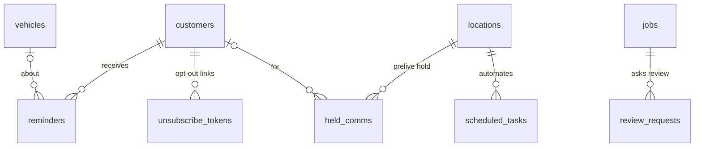

### `reminders`

One row per channel per send. Dedupe source (30 days per vehicle / type / channel) and cross-sender contact-cap source.

Scope: `location_id` + `organization_id` · RLS — select: `is_org_staff`

| Column | Type | Notes |
|---|---|---|
| `id` | `uuid` | PK |
| `location_id` | `uuid` | → `locations.id` (cascade) |
| `customer_id` | `uuid` | → `customers.id` (cascade) |
| `vehicle_id` | `uuid` | → `vehicles.id` (cascade) · _null_ |
| `type` | `text` | Free text: `mot`, `service`, `tax`, `campaign`, `custom`, `tyre_care`, … (no CHECK). |
| `channel` | `text` | `email` \| `sms` \| `whatsapp` (app-enforced). |
| `recipient_email` | `text` | _null_ |
| `subject` | `text` |  |
| `message_text` | `text` |  |
| `status` | `text` | `sent` \| `failed` |
| `error_message` | `text` | Provider error string. · _null_ |
| `sent_at` | `timestamptz` |  |
| `created_at` | `timestamptz` |  |
| `delivered_at` | `timestamptz` | _null_ |
| `opened_at` | `timestamptz` | _null_ |
| `clicked_at` | `timestamptz` | _null_ |
| `recipient_phone` | `text` | _null_ |
| `resend_email_id` | `text` | Used by the Resend webhook to find the row. · _null_ |
| `organization_id` | `uuid` | → `organizations.id` (cascade) |

### `scheduled_tasks`

Per-branch automation config; the hourly tick dispatches due rows by `task_type`.

Scope: `location_id` · RLS — select: `is_location_member`

Unique: `(location_id, task_type)`

| Column | Type | Notes |
|---|---|---|
| `id` | `uuid` | PK |
| `location_id` | `uuid` | → `locations.id` (cascade) |
| `task_type` | `text` | `mot_reminders` \| `service_reminders` \| `tax_reminders` \| `weekly_digest` \| `invoice_dunning` \| `review_requests` \| `booking_confirmations` \| `deferred_followups` \| `tyre_care` (see `TASK_ROUTE` in `/api/cron/tick`). |
| `enabled` | `bool` |  |
| `settings` | `jsonb` | Per-task config (channels, remind_days_before, …). |
| `last_run_at` | `timestamptz` | _null_ |
| `created_at` | `timestamptz` |  |
| `frequency` | `text` | `daily` \| `weekly` |
| `hour` | `int2` | 0–23 |
| `day_of_week` | `int2` | 0–6 (Sun=0). Weekly only. · _null_ |
| `next_run_at` | `timestamptz` | _null_ |

### `review_requests`

Post-service CSAT pulse + review interception (4–5★ → Google, 1–3★ → private + staff alert).

Scope: `location_id` + `organization_id` · RLS — select: `is_location_member`

| Column | Type | Notes |
|---|---|---|
| `id` | `uuid` | PK |
| `location_id` | `uuid` | → `locations.id` (cascade) |
| `organization_id` | `uuid` | → `organizations.id` (set null) · _null_ |
| `job_id` | `uuid` | → `jobs.id` (cascade) |
| `customer_id` | `uuid` | → `customers.id` (set null) · _null_ |
| `token_hash` | `text` | Unique. · _null_ |
| `status` | `text` | `queued` \| `sent` \| `responded` \| `failed` \| `suppressed` |
| `score` | `int4` | _null_ |
| `feedback_text` | `text` | _null_ |
| `channel` | `text` |  |
| `sent_at` | `timestamptz` | _null_ |
| `responded_at` | `timestamptz` | _null_ |
| `created_at` | `timestamptz` |  |

### `held_comms`

Prelive pending set: what an unattended cron *would* have sent. Keyed `(location, kind, ref)`, refreshed each run, pruned after 7 days.

Scope: `location_id` + `organization_id` · RLS — select: `is_location_member`

Unique: `(location_id, kind, ref_id)`

| Column | Type | Notes |
|---|---|---|
| `id` | `uuid` | PK |
| `location_id` | `uuid` | → `locations.id` (cascade) |
| `organization_id` | `uuid` | → `organizations.id` (cascade) · _null_ |
| `kind` | `text` | `mot_reminder` \| `service_reminder` \| `tax_reminder` \| `invoice_dunning` \| `review_request` \| `booking_confirmation` \| `deferred_followup` \| `quote_reminder` |
| `customer_id` | `uuid` | → `customers.id` (cascade) · _null_ |
| `ref_table` | `text` |  |
| `ref_id` | `uuid` |  |
| `summary` | `text` |  |
| `would_have_sent_at` | `timestamptz` |  |
| `last_seen_at` | `timestamptz` |  |
| `created_at` | `timestamptz` |  |

### `email_suppressions`

Hard-bounced / complained addresses from the Resend webhook; checked before every email send.

Scope: platform / global · RLS — select: `is_platform_admin`

| Column | Type | Notes |
|---|---|---|
| `email` | `text` | PK |
| `reason` | `text` | `hard_bounce` \| `complaint` |
| `detail` | `text` | _null_ |
| `resend_email_id` | `text` | _null_ |
| `first_seen_at` | `timestamptz` |  |
| `last_seen_at` | `timestamptz` |  |

### `unsubscribe_tokens`

Per-message marketing opt-out tokens (hash only, never overwritten).

Scope: `organization_id` · RLS on, **no policies** — service role only

| Column | Type | Notes |
|---|---|---|
| `token_hash` | `text` | PK · sha256 of a 128-bit token. PK. |
| `customer_id` | `uuid` | → `customers.id` (cascade) |
| `organization_id` | `uuid` | → `organizations.id` (cascade) |
| `source` | `text` |  |
| `created_at` | `timestamptz` |  |
| `used_at` | `timestamptz` | _null_ |

---

## Domain 7 · Recovery & tyre care

Revenue recovery: the deferred-work bank (#498) and tyre-care recommendations (#596). Tyre tables carry both a vehicle and a location FK, so their `WITH CHECK` also calls `private.vehicle_in_location_org()` (#619).

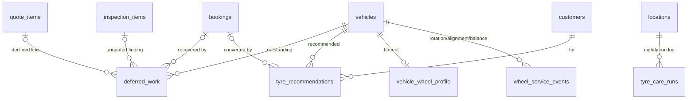

### `deferred_work`

Declined / not-quoted repairs banked for later follow-up. One open row per `(vehicle, lower(description))`.

Scope: `location_id` + `organization_id` · RLS — all: `is_location_member`

| Column | Type | Notes |
|---|---|---|
| `id` | `uuid` | PK |
| `location_id` | `uuid` | → `locations.id` (cascade) |
| `organization_id` | `uuid` | → `organizations.id` (cascade) · _null_ |
| `customer_id` | `uuid` | → `customers.id` (cascade) · _null_ |
| `vehicle_id` | `uuid` | → `vehicles.id` (cascade) · _null_ |
| `job_id` | `uuid` | → `jobs.id` (set null) · _null_ |
| `source` | `text` | `quote_item` \| `inspection_item` |
| `quote_item_id` | `uuid` | → `quote_items.id` (set null) · _null_ |
| `inspection_item_id` | `uuid` | → `inspection_items.id` (set null) · _null_ |
| `description` | `text` |  |
| `price` | `numeric(10,2)` | _null_ |
| `rag` | `text` | `amber` \| `red` · _null_ |
| `status` | `text` | `open` \| `recovered` \| `dismissed` |
| `followup_count` | `int4` |  |
| `last_followup_at` | `timestamptz` | _null_ |
| `book_token_hash` | `text` | _null_ |
| `recovered_booking_id` | `uuid` | → `bookings.id` (set null) · _null_ |
| `recovered_at` | `timestamptz` | _null_ |
| `dismissed_reason` | `text` | _null_ |
| `created_at` | `timestamptz` |  |
| `updated_at` | `timestamptz` |  |

### `tyre_recommendations`

Tyre-care queue items with the evidence they rest on; staff approve & send or dismiss with a reason.

Scope: `location_id` + `organization_id` · RLS — select: `is_location_member`

Unique: `(vehicle_id, service_type) WHERE (status = 'pending_review'::text)`

| Column | Type | Notes |
|---|---|---|
| `id` | `uuid` | PK |
| `location_id` | `uuid` | → `locations.id` (cascade) |
| `organization_id` | `uuid` | → `organizations.id` (cascade) · _null_ |
| `customer_id` | `uuid` | → `customers.id` (cascade) |
| `vehicle_id` | `uuid` | → `vehicles.id` (cascade) |
| `service_type` | `text` | `rotation` \| `alignment` \| `balance` |
| `confidence` | `text` | `high` \| `low` |
| `evidence` | `jsonb` | Evidence snapshot the recommendation rests on (rule key, readings, customer-facing reason). |
| `status` | `text` | `pending_review` \| `approved_sent` \| `dismissed` \| `converted` \| `expired` |
| `dismissed_reason` | `text` | _null_ |
| `reviewed_by` | `uuid` | → `auth.users.id` (set null) · _null_ |
| `reviewed_at` | `timestamptz` | _null_ |
| `book_token_hash` | `text` | _null_ |
| `sent_at` | `timestamptz` | _null_ |
| `converted_booking_id` | `uuid` | → `bookings.id` (set null) · _null_ |
| `converted_at` | `timestamptz` | _null_ |
| `created_at` | `timestamptz` |  |
| `updated_at` | `timestamptz` |  |

### `tyre_care_runs`

One row per nightly tyre-care run per branch (coverage counts for the results page).

Scope: `location_id` + `organization_id` · RLS — select: `is_location_member`

| Column | Type | Notes |
|---|---|---|
| `id` | `int8` | PK |
| `location_id` | `uuid` | → `locations.id` (cascade) |
| `organization_id` | `uuid` | → `organizations.id` (cascade) · _null_ |
| `ran_at` | `timestamptz` |  |
| `vehicles` | `int4` |  |
| `with_history` | `int4` |  |
| `with_estimate` | `int4` |  |
| `raised` | `int4` |  |
| `refreshed` | `int4` |  |
| `expired` | `int4` |  |
| `truncated` | `bool` |  |

### `vehicle_wheel_profile`

Confirmed wheel setup (standard / directional / staggered) — rotation can't be sent until it's standard.

Scope: `organization_id` · RLS — select: `is_org_staff`

| Column | Type | Notes |
|---|---|---|
| `vehicle_id` | `uuid` | PK · → `vehicles.id` (cascade) |
| `organization_id` | `uuid` | → `organizations.id` (cascade) |
| `tyre_config` | `text` | `standard` \| `directional` \| `staggered` \| `unknown` |
| `notes` | `text` | _null_ |
| `recorded_by` | `uuid` | → `auth.users.id` (set null) · _null_ |
| `updated_at` | `timestamptz` |  |

### `wheel_service_events`

Rotations, alignments and balances performed (baseline for tyre care).

Scope: `location_id` + `organization_id` · RLS — all: `is_location_member` / `vehicle_in_location_org` · select: `is_org_staff`

| Column | Type | Notes |
|---|---|---|
| `id` | `uuid` | PK |
| `location_id` | `uuid` | → `locations.id` (cascade) |
| `organization_id` | `uuid` | → `organizations.id` (cascade) · _null_ |
| `vehicle_id` | `uuid` | → `vehicles.id` (cascade) |
| `service_type` | `text` | `rotation` \| `alignment` \| `balance` |
| `performed_at` | `date` |  |
| `odometer_miles` | `int4` | _null_ |
| `job_id` | `uuid` | → `jobs.id` (set null) · _null_ |
| `recorded_by` | `uuid` | → `auth.users.id` (set null) · _null_ |
| `created_at` | `timestamptz` |  |

---

## Domain 8 · Inventory & purchasing

Branch parts catalogue and purchasing. Parts are `products` rows matched by `(location_id, sku)`; `supplier_integrations` holds encrypted per-branch connector credentials (service role only).

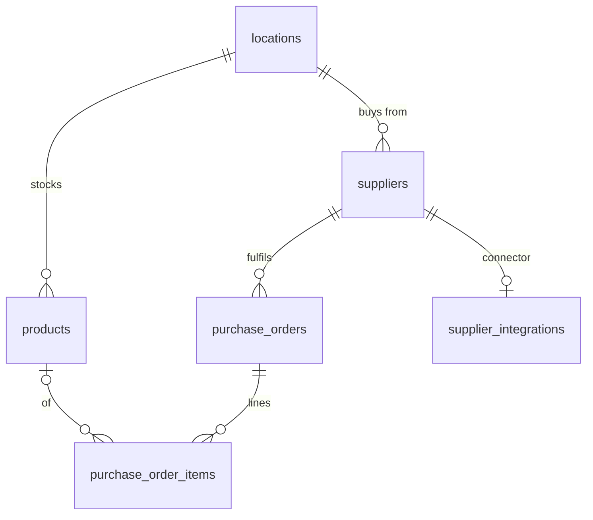

### `products`

Branch parts inventory with cost / sell price and stock levels.

Scope: `location_id` · RLS — select: `is_location_member`

| Column | Type | Notes |
|---|---|---|
| `id` | `uuid` | PK |
| `location_id` | `uuid` | → `locations.id` (cascade) |
| `name` | `text` |  |
| `category` | `text` |  |
| `sku` | `text` | _null_ |
| `supplier` | `text` | _null_ |
| `unit_price` | `numeric(10,2)` |  |
| `cost_price` | `numeric(10,2)` | _null_ |
| `stock_qty` | `int4` |  |
| `reorder_at` | `int4` | _null_ |
| `active` | `bool` |  |
| `created_at` | `timestamptz` |  |

### `suppliers`

Branch supplier (factor) contacts.

Scope: `location_id` · RLS — select: `is_location_member`

| Column | Type | Notes |
|---|---|---|
| `id` | `uuid` | PK |
| `location_id` | `uuid` | → `locations.id` (cascade) |
| `name` | `text` |  |
| `contact_email` | `text` | _null_ |
| `contact_phone` | `text` | _null_ |
| `notes` | `text` | _null_ |
| `created_at` | `timestamptz` |  |

### `supplier_integrations`

Per-branch supplier connector config; credentials encrypted, service role only.

Scope: `location_id` + `organization_id` · RLS on, **deny-all** (`using (false)`) — service role only

| Column | Type | Notes |
|---|---|---|
| `id` | `uuid` | PK |
| `supplier_id` | `uuid` | → `suppliers.id` (cascade) · Unique. |
| `location_id` | `uuid` | → `locations.id` (cascade) |
| `organization_id` | `uuid` | → `organizations.id` (cascade) · _null_ |
| `kind` | `text` |  |
| `enabled` | `bool` |  |
| `punchout_url_template` | `text` | _null_ |
| `order_email` | `text` | _null_ |
| `account_number` | `text` | _null_ |
| `credentials` | `text` | _null_ |
| `settings` | `jsonb` |  |
| `created_at` | `timestamptz` |  |
| `updated_at` | `timestamptz` |  |

### `purchase_orders`

Purchase orders to a supplier, with send channel and pasted confirmation.

Scope: `location_id` · RLS — select: `is_location_member`

| Column | Type | Notes |
|---|---|---|
| `id` | `uuid` | PK |
| `location_id` | `uuid` | → `locations.id` (cascade) |
| `supplier_id` | `uuid` | → `suppliers.id` (set null) · _null_ |
| `reference` | `text` | _null_ |
| `status` | `text` | `draft` \| `ordered` \| `received` \| `cancelled` |
| `notes` | `text` | _null_ |
| `created_by` | `uuid` | _null_ |
| `ordered_at` | `timestamptz` | _null_ |
| `received_at` | `timestamptz` | _null_ |
| `created_at` | `timestamptz` |  |
| `sent_at` | `timestamptz` | _null_ |
| `sent_channel` | `text` | _null_ |
| `supplier_order_ref` | `text` | _null_ |
| `confirmation_imported_at` | `timestamptz` | _null_ |
| `confirmation_raw` | `text` | _null_ |

### `purchase_order_items`

PO lines; confirmed costs reconcile onto them.

Scope: platform / global · RLS — select: `is_location_member`

| Column | Type | Notes |
|---|---|---|
| `id` | `uuid` | PK |
| `purchase_order_id` | `uuid` | → `purchase_orders.id` (cascade) |
| `product_id` | `uuid` | → `products.id` (set null) · _null_ |
| `description` | `text` |  |
| `quantity` | `numeric` |  |
| `unit_cost` | `numeric` |  |
| `sort_order` | `int4` |  |
| `created_at` | `timestamptz` |  |

---

## Domain 9 · Memberships & plans

Garage-sold memberships billed as Stripe subscriptions on the garage's **connected** account.

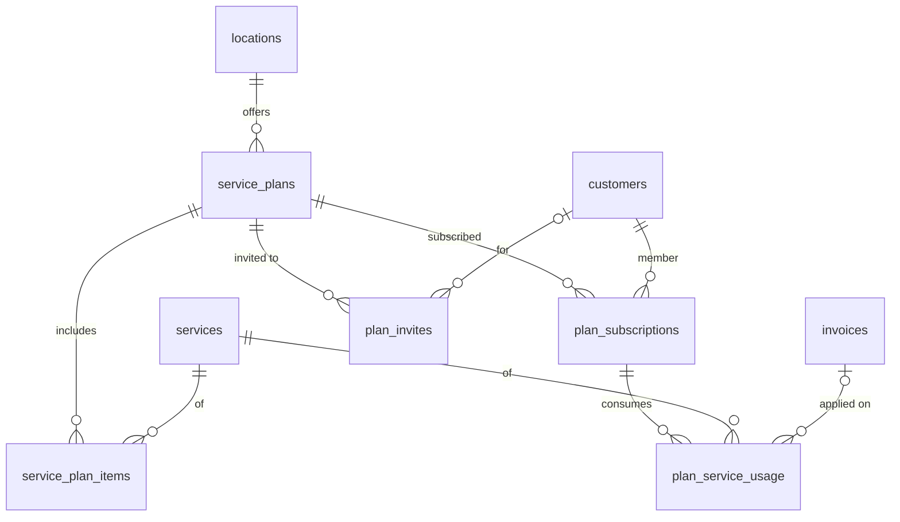

### `service_plans`

Membership plans sold by a garage (Stripe product + prices on the connected account).

Scope: `location_id` + `organization_id` · RLS — select: `is_org_staff`

| Column | Type | Notes |
|---|---|---|
| `id` | `uuid` | PK |
| `location_id` | `uuid` | → `locations.id` (cascade) |
| `name` | `text` |  |
| `description` | `text` | _null_ |
| `price_monthly_pence` | `int4` | _null_ |
| `price_annual_pence` | `int4` | _null_ |
| `stripe_product_id` | `text` | _null_ |
| `stripe_price_monthly_id` | `text` | _null_ |
| `stripe_price_annual_id` | `text` | _null_ |
| `active` | `bool` |  |
| `created_by` | `uuid` | _null_ |
| `created_at` | `timestamptz` |  |
| `discount_type` | `text` | `none` \| `percent` \| `fixed` |
| `discount_value` | `numeric` |  |
| `organization_id` | `uuid` | → `organizations.id` (cascade) |

### `service_plan_items`

Services included in a plan, with a per-period quota.

Scope: platform / global · RLS — select: `is_location_member`

| Column | Type | Notes |
|---|---|---|
| `id` | `uuid` | PK |
| `service_plan_id` | `uuid` | → `service_plans.id` (cascade) |
| `service_id` | `uuid` | → `services.id` (cascade) |
| `quantity_per_period` | `int4` |  |
| `created_at` | `timestamptz` |  |

### `plan_subscriptions`

A customer's live plan subscription, synced from Stripe.

Scope: `location_id` + `organization_id` · RLS — select: `is_org_staff`

| Column | Type | Notes |
|---|---|---|
| `id` | `uuid` | PK |
| `location_id` | `uuid` | → `locations.id` (cascade) |
| `service_plan_id` | `uuid` | → `service_plans.id` (set null) · _null_ |
| `customer_id` | `uuid` | → `customers.id` (set null) · _null_ |
| `stripe_subscription_id` | `text` | Unique. · _null_ |
| `stripe_customer_id` | `text` | _null_ |
| `interval` | `text` | _null_ |
| `status` | `text` |  |
| `current_period_end` | `timestamptz` | _null_ |
| `cancel_at_period_end` | `bool` |  |
| `created_at` | `timestamptz` |  |
| `updated_at` | `timestamptz` |  |
| `organization_id` | `uuid` | → `organizations.id` (cascade) |
| `paid_in_pence` | `int8` |  |
| `benefits_start_at` | `timestamptz` | _null_ |

### `plan_invites`

Token-gated invites for a customer to self-subscribe.

Scope: `location_id` · RLS — select: `is_location_member`

| Column | Type | Notes |
|---|---|---|
| `id` | `uuid` | PK |
| `location_id` | `uuid` | → `locations.id` (cascade) |
| `service_plan_id` | `uuid` | → `service_plans.id` (cascade) |
| `customer_id` | `uuid` | → `customers.id` (set null) · _null_ |
| `slug` | `text` | Unique. |
| `token_hash` | `text` |  |
| `status` | `text` | `pending` \| `subscribed` \| `expired` \| `cancelled` |
| `expires_at` | `timestamptz` |  |
| `created_by` | `uuid` | _null_ |
| `created_at` | `timestamptz` |  |
| `subscribed_at` | `timestamptz` | _null_ |

### `plan_service_usage`

Included-service allowance consumed per period.

Scope: platform / global · RLS — select: `is_location_member`

| Column | Type | Notes |
|---|---|---|
| `id` | `uuid` | PK |
| `plan_subscription_id` | `uuid` | → `plan_subscriptions.id` (cascade) |
| `service_id` | `uuid` | → `services.id` (cascade) |
| `invoice_id` | `uuid` | → `invoices.id` (cascade) · _null_ |
| `period_end` | `timestamptz` |  |
| `covered_qty` | `int4` |  |
| `created_at` | `timestamptz` |  |
| `booking_id` | `uuid` | → `bookings.id` (set null) · _null_ |
| `status` | `text` | `reserved` \| `consumed` \| `released` |
| `walk_in_pence` | `int4` |  |

---

## Domain 10 · Accounting & imports

Provider-neutral accounting sync (Xero / QuickBooks / Sage — one connection per org) and the migration toolkit's import batches. Imported invoices are read-only history, excluded from numbering, VAT, revenue and sync.

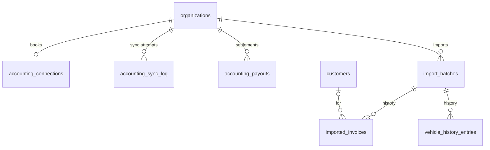

### `accounting_connections`

The org's one accounting connection (Xero / QuickBooks / Sage). Tokens AES-encrypted; service role only.

Scope: `organization_id` · RLS on, **deny-all** (`using (false)`) — service role only

| Column | Type | Notes |
|---|---|---|
| `id` | `uuid` | PK |
| `organization_id` | `uuid` | → `organizations.id` (cascade) · Unique. |
| `provider` | `text` | `xero` \| `quickbooks` \| `sage` |
| `external_id` | `text` |  |
| `display_name` | `text` | _null_ |
| `access_token` | `text` | AES-256-GCM encrypted (`src/lib/encryption.ts`). · _null_ |
| `refresh_token` | `text` | AES-256-GCM encrypted. · _null_ |
| `token_expires_at` | `timestamptz` | _null_ |
| `connected_at` | `timestamptz` |  |
| `connected_by` | `uuid` | → `auth.users.id` (set null) · _null_ |
| `created_at` | `timestamptz` |  |
| `needs_reconnect` | `bool` |  |
| `last_refresh_error` | `text` | _null_ |
| `last_refresh_error_at` | `timestamptz` | _null_ |
| `reconnect_alerted_at` | `timestamptz` | _null_ |

### `accounting_sync_log`

Per-entity sync attempts and errors.

Scope: `organization_id` · RLS — select: `is_org_finance`

| Column | Type | Notes |
|---|---|---|
| `id` | `uuid` | PK |
| `organization_id` | `uuid` | → `organizations.id` (cascade) |
| `provider` | `text` |  |
| `entity_type` | `text` | `invoice` \| `payment` \| `credit_note` \| `payout` \| `contact` \| `connection` |
| `entity_id` | `uuid` | _null_ |
| `external_id` | `text` | _null_ |
| `status` | `text` | `synced` \| `failed` |
| `error` | `text` | _null_ |
| `created_at` | `timestamptz` |  |

### `accounting_payouts`

Idempotency tracker for Stripe payout → accounting bank-transaction sync.

Scope: `organization_id` · RLS on, **deny-all** (`using (false)`) — service role only

Unique: `(organization_id, stripe_payout_id)`

| Column | Type | Notes |
|---|---|---|
| `id` | `uuid` | PK |
| `organization_id` | `uuid` | → `organizations.id` (cascade) |
| `stripe_payout_id` | `text` |  |
| `stripe_account_id` | `text` |  |
| `external_transaction_id` | `text` | _null_ |
| `amount_pence` | `int4` |  |
| `arrival_date` | `date` |  |
| `pushed_at` | `timestamptz` |  |
| `provider` | `text` |  |

### `import_batches`

One row per import commit; every imported row carries its batch id for all-or-nothing rollback.

Scope: `location_id` + `organization_id` · RLS — select: `is_org_staff`

| Column | Type | Notes |
|---|---|---|
| `id` | `uuid` | PK |
| `organization_id` | `uuid` | → `organizations.id` (cascade) |
| `location_id` | `uuid` | → `locations.id` (cascade) |
| `kind` | `text` | `customers` \| `history` \| `reminders` \| `invoices` |
| `filename` | `text` | _null_ |
| `total_rows` | `int4` |  |
| `imported_rows` | `int4` |  |
| `rejected_rows` | `int4` |  |
| `created_by` | `uuid` | → `auth.users.id` (set null) · _null_ |
| `created_at` | `timestamptz` |  |

### `imported_invoices`

Read-only invoice history from a previous system.

Scope: `organization_id` · RLS — select: `is_org_staff`

| Column | Type | Notes |
|---|---|---|
| `id` | `uuid` | PK |
| `organization_id` | `uuid` | → `organizations.id` (cascade) |
| `customer_id` | `uuid` | → `customers.id` (cascade) |
| `vehicle_id` | `uuid` | → `vehicles.id` (set null) · _null_ |
| `invoice_number` | `text` |  |
| `issued_on` | `date` |  |
| `total` | `numeric(10,2)` |  |
| `status` | `text` | _null_ |
| `description` | `text` | _null_ |
| `import_batch_id` | `uuid` | → `import_batches.id` (set null) · _null_ |
| `created_at` | `timestamptz` |  |

---

## Domain 11 · Growth surfaces

Public mini-site config and the AI receptionist.

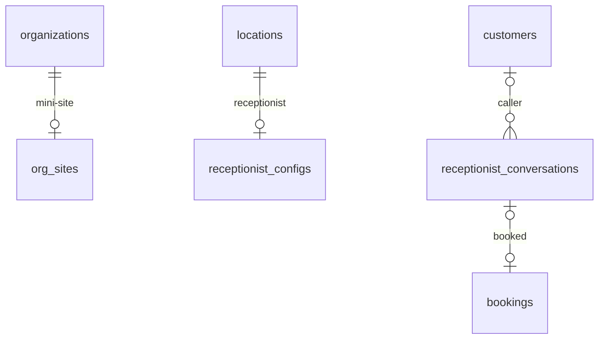

### `org_sites`

Mini-site config, one row per org (publish flag, sections, copy, gallery).

Scope: `organization_id` · RLS — select: `published = true` (incl. anon); `is_org_staff`

| Column | Type | Notes |
|---|---|---|
| `organization_id` | `uuid` | PK · → `organizations.id` (cascade) |
| `published` | `bool` |  |
| `sections` | `jsonb` |  |
| `strapline` | `text` | _null_ |
| `about` | `text` | _null_ |
| `gallery_paths` | `text[]` |  |
| `updated_at` | `timestamptz` |  |

### `receptionist_configs`

Per-branch AI receptionist Twilio number and call forwarding.

Scope: `location_id` · RLS — select: `is_location_member`

| Column | Type | Notes |
|---|---|---|
| `id` | `uuid` | PK |
| `location_id` | `uuid` | → `locations.id` (cascade) · Unique. |
| `enabled` | `bool` |  |
| `twilio_number` | `text` | Unique. · _null_ |
| `forward_to_phone` | `text` | _null_ |
| `forward_timeout_seconds` | `int2` |  |
| `created_at` | `timestamptz` |  |
| `updated_at` | `timestamptz` |  |
| `twilio_number_sid` | `text` | _null_ |

### `receptionist_conversations`

AI receptionist conversations (SMS / WhatsApp / voice) and any booking they produced.

Scope: `location_id` · RLS — select: `is_location_member`

| Column | Type | Notes |
|---|---|---|
| `id` | `uuid` | PK |
| `location_id` | `uuid` | → `locations.id` (cascade) |
| `customer_phone` | `text` |  |
| `channel` | `text` | `sms` \| `whatsapp` |
| `status` | `text` | `active` \| `completed` \| `handed_off` \| `expired` |
| `source` | `text` | `inbound_message` \| `missed_call` |
| `customer_id` | `uuid` | → `customers.id` (set null) · _null_ |
| `booking_id` | `uuid` | → `bookings.id` (set null) · _null_ |
| `messages` | `jsonb` |  |
| `started_at` | `timestamptz` |  |
| `last_message_at` | `timestamptz` |  |

---

## Domain 12 · Platform & system

Audit, sharing, webhooks, notifications, flags, AI metering and support. Several tables here are deny-all under RLS and reached only through the service role.

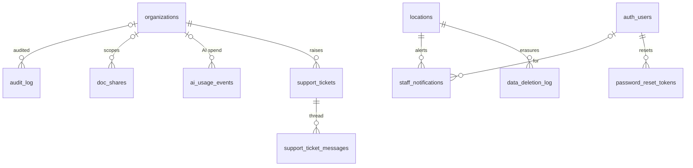

### `audit_log`

Append-only record of staff and operator actions.

Scope: `organization_id` · RLS — select: inline org-role check

| Column | Type | Notes |
|---|---|---|
| `id` | `uuid` | PK |
| `organization_id` | `uuid` | → `organizations.id` (set null) · NULL for platform-scope events. · _null_ |
| `actor_user_id` | `uuid` | → `auth.users.id` (set null) · _null_ |
| `actor_email` | `text` | Snapshot at action time. · _null_ |
| `action` | `text` | `settings.update` / `stripe.connect_complete` / `xero.connect_complete` / `xero.disconnect` / `dpa.accept` / `doc_share.mint` / `doc_share.revoke` / `impersonation.start` / `impersonation.stop` / … |
| `entity_type` | `text` | e.g. `organization`, `stripe_account`, `doc_share`. · _null_ |
| `entity_id` | `text` | The id of the affected entity. · _null_ |
| `metadata` | `jsonb` | Free-form context per action. |
| `ip_address` | `text` | _null_ |
| `user_agent` | `text` | _null_ |
| `created_at` | `timestamptz` |  |

### `doc_shares`

Signed-link gates for internal HTML docs. Deny-all under RLS; admin portal only.

Scope: `organization_id` · RLS on, **no policies** — service role only

| Column | Type | Notes |
|---|---|---|
| `id` | `uuid` | PK |
| `slug` | `text` | Unique. · Public path segment. |
| `doc_key` | `text` | e.g. `technical`. Mapped to file path by the route. |
| `token_hash` | `text` | **SHA-256 hex.** Raw token shown once on mint. |
| `label` | `text` | Internal note. · _null_ |
| `expires_at` | `timestamptz` | _null_ |
| `max_views` | `int4` | _null_ |
| `view_count` | `int4` | Bumped atomically via a SECURITY DEFINER RPC. |
| `organization_id` | `uuid` | → `organizations.id` (cascade) · NULL = platform-scope share. · _null_ |
| `created_by` | `uuid` | → `auth.users.id` (set null) · _null_ |
| `created_at` | `timestamptz` |  |
| `revoked_at` | `timestamptz` | _null_ |
| `revoked_by` | `uuid` | → `auth.users.id` (set null) · _null_ |
| `last_viewed_at` | `timestamptz` | _null_ |

### `stripe_webhook_events`

Stripe event ids claimed once, so a replayed webhook is a no-op.

Scope: platform / global · RLS on, **deny-all** (`using (false)`) — service role only

| Column | Type | Notes |
|---|---|---|
| `id` | `text` | PK |
| `type` | `text` |  |
| `received_at` | `timestamptz` |  |
| `processed_at` | `timestamptz` | _null_ |

### `webhook_deliveries`

Inbound webhook telemetry (provider, status, latency) for the health dashboard.

Scope: platform / global · RLS on, **deny-all** (`using (false)`) — service role only

| Column | Type | Notes |
|---|---|---|
| `id` | `int8` | PK |
| `provider` | `text` |  |
| `event_type` | `text` | _null_ |
| `ok` | `bool` |  |
| `status_code` | `int4` | _null_ |
| `latency_ms` | `int4` | _null_ |
| `error` | `text` | _null_ |
| `received_at` | `timestamptz` |  |

### `staff_notifications`

In-app notifications (the rail bell).

Scope: `location_id` + `organization_id` · RLS — select: `is_location_member` · update: `is_location_member`

| Column | Type | Notes |
|---|---|---|
| `id` | `uuid` | PK |
| `user_id` | `uuid` | → `auth.users.id` (cascade) · _null_ |
| `location_id` | `uuid` | → `locations.id` (cascade) |
| `organization_id` | `uuid` | → `organizations.id` (cascade) · _null_ |
| `kind` | `text` |  |
| `title` | `text` |  |
| `body` | `text` | _null_ |
| `href` | `text` | _null_ |
| `entity_type` | `text` | _null_ |
| `entity_id` | `uuid` | _null_ |
| `read_at` | `timestamptz` | _null_ |
| `created_at` | `timestamptz` |  |

### `data_deletion_log`

GDPR erasure audit; one row per anonymisation pass.

Scope: `location_id` · RLS on, **deny-all** (`using (false)`) — service role only

| Column | Type | Notes |
|---|---|---|
| `id` | `uuid` | PK |
| `location_id` | `uuid` | → `locations.id` (cascade) |
| `customer_id` | `uuid` | Deliberately no FK, so the id survives the row scrub. · _null_ |
| `customer_email_hash` | `text` | SHA-256 of the original email: proof of erasure. · _null_ |
| `reason` | `text` |  |
| `requested_by` | `uuid` | _null_ |
| `deleted_at` | `timestamptz` |  |
| `notes` | `text` | _null_ |

### `password_reset_tokens`

Single-use password-reset token ids (`jti`), consumed once.

Scope: platform / global · RLS on, **deny-all** (`using (false)`) — service role only

| Column | Type | Notes |
|---|---|---|
| `jti` | `text` | PK · Token id; PK. Consumed once. |
| `user_id` | `uuid` |  |
| `consumed_at` | `timestamptz` |  |
| `expires_at` | `timestamptz` |  |

### `feature_flags`

Global flag overrides; the registry in `src/lib/feature-flags.ts` is the source of truth.

Scope: platform / global · RLS — select: `is_platform_admin`

| Column | Type | Notes |
|---|---|---|
| `key` | `text` | PK |
| `enabled` | `bool` |  |
| `updated_at` | `timestamptz` |  |
| `updated_by` | `uuid` | → `auth.users.id` (set null) · _null_ |

### `ai_usage_events`

Token usage and estimated cost per AI call, by feature and model.

Scope: `location_id` + `organization_id` · RLS — select: `is_location_member`

| Column | Type | Notes |
|---|---|---|
| `id` | `uuid` | PK |
| `location_id` | `uuid` | → `locations.id` (cascade) |
| `organization_id` | `uuid` | → `organizations.id` (cascade) · _null_ |
| `user_id` | `uuid` | _null_ |
| `feature` | `text` |  |
| `model` | `text` |  |
| `input_tokens` | `int4` |  |
| `output_tokens` | `int4` |  |
| `cost_pence` | `numeric` |  |
| `created_at` | `timestamptz` |  |

### `support_tickets`

Staff → platform support tickets and feature requests.

Scope: `location_id` + `organization_id` · RLS — select: `is_org_staff`

| Column | Type | Notes |
|---|---|---|
| `id` | `uuid` | PK |
| `organization_id` | `uuid` | → `organizations.id` (cascade) |
| `location_id` | `uuid` | → `locations.id` (set null) · _null_ |
| `created_by` | `uuid` | → `auth.users.id` (set null) · _null_ |
| `requester_name` | `text` | _null_ |
| `requester_email` | `text` | _null_ |
| `type` | `text` | `bug` \| `question` \| `feature_request` |
| `status` | `text` | `open` \| `needs_info` \| `in_progress` \| `planned` \| `resolved` \| `closed` \| `declined` |
| `priority` | `text` | `p1` \| `p2` \| `p3` \| `p4` |
| `subject` | `text` |  |
| `context` | `jsonb` |  |
| `assigned_to` | `uuid` | → `auth.users.id` (set null) · _null_ |
| `first_response_at` | `timestamptz` | _null_ |
| `resolved_at` | `timestamptz` | _null_ |
| `last_activity_at` | `timestamptz` |  |
| `created_at` | `timestamptz` |  |

### `support_ticket_messages`

Ticket thread; internal notes are hidden from tenants by the RLS policy itself.

Scope: `organization_id` · RLS — select: `is_org_staff`

| Column | Type | Notes |
|---|---|---|
| `id` | `uuid` | PK |
| `ticket_id` | `uuid` | → `support_tickets.id` (cascade) |
| `organization_id` | `uuid` | → `organizations.id` (cascade) |
| `author_user_id` | `uuid` | → `auth.users.id` (set null) · _null_ |
| `author_kind` | `text` | `staff` \| `platform_admin` |
| `author_name` | `text` | _null_ |
| `internal` | `bool` | Internal notes — excluded by the tenant RLS select policy itself. |
| `body` | `text` |  |
| `created_at` | `timestamptz` |  |

---

## Domain 13 · Reliability & analytics

Operator-side reliability telemetry and first-party traffic analytics. No tenant access.

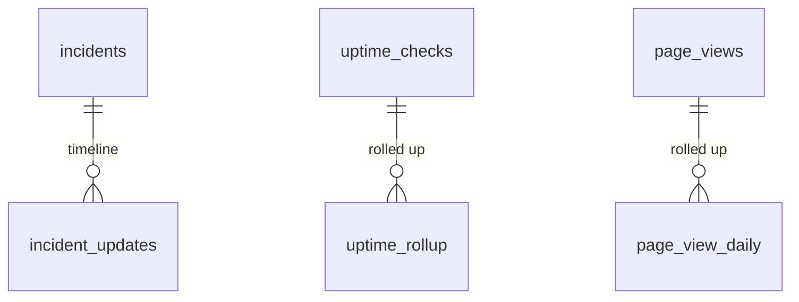

### `cron_runs`

Run history for every cron job (feeds the dead-cron alert rule).

Scope: platform / global · RLS on, **deny-all** (`using (false)`) — service role only

| Column | Type | Notes |
|---|---|---|
| `id` | `int8` | PK |
| `job` | `text` |  |
| `ok` | `bool` |  |
| `duration_ms` | `int4` | _null_ |
| `detail` | `text` | _null_ |
| `ran_at` | `timestamptz` |  |

### `mot_delta_runs`

DVSA bulk MOT delta file processing runs.

Scope: platform / global · RLS on, **deny-all** (`using (false)`) — service role only

| Column | Type | Notes |
|---|---|---|
| `id` | `int8` | PK |
| `filename` | `text` | Unique. |
| `file_created_on` | `timestamptz` | _null_ |
| `status` | `text` | `done` \| `error` |
| `scanned_count` | `int4` |  |
| `matched_count` | `int4` |  |
| `updated_count` | `int4` |  |
| `moted_elsewhere_count` | `int4` |  |
| `error` | `text` | _null_ |
| `duration_ms` | `int4` | _null_ |
| `processed_at` | `timestamptz` |  |

### `alert_rules`

Operator alert rules (metric, threshold, window, channels) and last delivery outcome.

Scope: platform / global · RLS on, **deny-all** (`using (false)`) — service role only

| Column | Type | Notes |
|---|---|---|
| `id` | `text` | PK |
| `name` | `text` |  |
| `metric` | `text` |  |
| `operator` | `text` | `>` \| `<` \| `>=` \| `<=` |
| `threshold` | `numeric` |  |
| `window_secs` | `int4` |  |
| `source` | `text` |  |
| `severity` | `text` | `SEV-1` \| `SEV-2` \| `SEV-3` \| `SEV-4` |
| `auto_declare` | `bool` |  |
| `channels` | `text[]` |  |
| `enabled` | `bool` |  |
| `last_fired_at` | `timestamptz` | _null_ |
| `last_delivery` | `text` | _null_ |

### `incidents`

Declared incidents (auto or manual), published to `/status`.

Scope: platform / global · RLS on, **deny-all** (`using (false)`) — service role only

| Column | Type | Notes |
|---|---|---|
| `id` | `uuid` | PK |
| `ref` | `text` | Unique. |
| `title` | `text` |  |
| `severity` | `text` | `SEV-1` \| `SEV-2` \| `SEV-3` \| `SEV-4` |
| `status` | `text` | `Investigating` \| `Identified` \| `Monitoring` \| `Resolved` |
| `components` | `text[]` |  |
| `lead_user_id` | `uuid` | → `auth.users.id` · _null_ |
| `published` | `bool` |  |
| `acked_at` | `timestamptz` | _null_ |
| `auto_declared` | `bool` |  |
| `alert_rule_id` | `text` | _null_ |
| `started_at` | `timestamptz` |  |
| `resolved_at` | `timestamptz` | _null_ |

### `incident_updates`

Timeline entries on an incident.

Scope: platform / global · RLS on, **deny-all** (`using (false)`) — service role only

| Column | Type | Notes |
|---|---|---|
| `id` | `int8` | PK |
| `incident_id` | `uuid` | → `incidents.id` (cascade) |
| `status` | `text` |  |
| `body` | `text` |  |
| `actor_email` | `text` | _null_ |
| `public` | `bool` |  |
| `created_at` | `timestamptz` |  |

### `uptime_checks`

Raw probe results (endpoints, tenants, golden path).

Scope: `location_id` + `organization_id` · RLS on, **deny-all** (`using (false)`) — service role only

| Column | Type | Notes |
|---|---|---|
| `id` | `int8` | PK |
| `target_kind` | `text` | `tenant` \| `service` \| `endpoint` |
| `target_key` | `text` |  |
| `location_id` | `uuid` | → `locations.id` (cascade) · _null_ |
| `ok` | `bool` |  |
| `status_code` | `int4` | _null_ |
| `latency_ms` | `int4` | _null_ |
| `region` | `text` |  |
| `error` | `text` | _null_ |
| `checked_at` | `timestamptz` |  |
| `organization_id` | `uuid` | → `organizations.id` (cascade) · _null_ |

### `uptime_rollup`

Hourly uptime / latency percentiles per target.

Scope: platform / global · RLS on, **deny-all** (`using (false)`) — service role only

Primary key: `(target_kind, target_key, bucket_hour)`

| Column | Type | Notes |
|---|---|---|
| `target_kind` | `text` |  |
| `target_key` | `text` |  |
| `bucket_hour` | `timestamptz` |  |
| `samples` | `int4` |  |
| `ok_samples` | `int4` |  |
| `p50_ms` | `int4` | _null_ |
| `p95_ms` | `int4` | _null_ |
| `p99_ms` | `int4` | _null_ |

### `latency_samples`

DB and Redis latency samples.

Scope: `organization_id` · RLS on, **no policies** — service role only

| Column | Type | Notes |
|---|---|---|
| `id` | `int8` | PK |
| `kind` | `text` | `infra` \| `tenant` |
| `organization_id` | `uuid` | → `organizations.id` (cascade) · _null_ |
| `target_key` | `text` | _null_ |
| `db_ms` | `int4` | _null_ |
| `redis_ms` | `int4` | _null_ |
| `total_ms` | `int4` | _null_ |
| `checked_at` | `timestamptz` |  |

### `sentry_issues`

Snapshot of top Sentry issues.

Scope: platform / global · RLS on, **deny-all** (`using (false)`) — service role only

| Column | Type | Notes |
|---|---|---|
| `id` | `int8` | PK |
| `rank` | `int4` |  |
| `title` | `text` |  |
| `culprit` | `text` | _null_ |
| `level` | `text` | _null_ |
| `events` | `int8` | _null_ |
| `users` | `int4` | _null_ |
| `last_seen` | `timestamptz` | _null_ |
| `permalink` | `text` | _null_ |
| `captured_at` | `timestamptz` |  |

### `sentry_snapshot`

Sentry error-rate snapshot.

Scope: platform / global · RLS on, **deny-all** (`using (false)`) — service role only

| Column | Type | Notes |
|---|---|---|
| `id` | `bool` | PK |
| `ok` | `bool` |  |
| `error_rate_pct` | `numeric` | _null_ |
| `events_24h` | `int8` | _null_ |
| `detail` | `text` | _null_ |
| `fetched_at` | `timestamptz` |  |

### `page_views`

Raw first-party page views (daily-rotating visitor hash, normalised paths). 90-day retention.

Scope: `organization_id` · RLS on, **no policies** — service role only

| Column | Type | Notes |
|---|---|---|
| `id` | `int8` | PK |
| `occurred_at` | `timestamptz` |  |
| `organization_id` | `uuid` | → `organizations.id` (cascade) · _null_ |
| `surface` | `text` |  |
| `path` | `text` | Normalised; token segments always masked. |
| `visitor_hash` | `text` | sha256(secret ∥ utc-day ∥ ip ∥ ua ∥ host), rotates daily. Raw IP never stored. |
| `referrer_host` | `text` | _null_ |
| `device` | `text` |  |
| `browser` | `text` |  |
| `os` | `text` |  |
| `country` | `text` | _null_ |
| `region` | `text` | _null_ |
| `city` | `text` | _null_ |

### `page_view_daily`

Daily traffic rollup per org and surface, kept indefinitely.

Scope: `organization_id` · RLS on, **no policies** — service role only

| Column | Type | Notes |
|---|---|---|
| `id` | `int8` | PK |
| `day` | `date` |  |
| `organization_id` | `uuid` | → `organizations.id` (cascade) · _null_ |
| `surface` | `text` |  |
| `pageviews` | `int4` |  |
| `visitors` | `int4` |  |
| `device_counts` | `jsonb` |  |
| `browser_counts` | `jsonb` |  |
| `country_counts` | `jsonb` |  |
| `city_counts` | `jsonb` |  |
| `referrer_counts` | `jsonb` |  |
| `path_counts` | `jsonb` |  |

---

Generated from the local schema at migration `20260927160000` on 2026-09-28. Regenerate after adding tables, and add the table to the domain map in the technical doc (§05).
